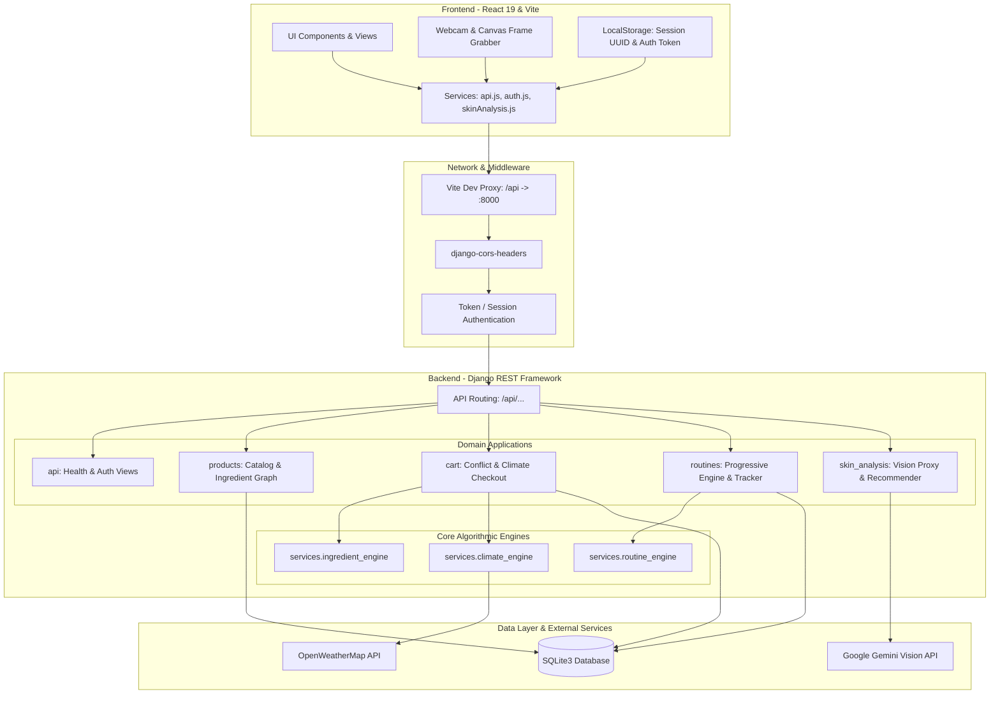
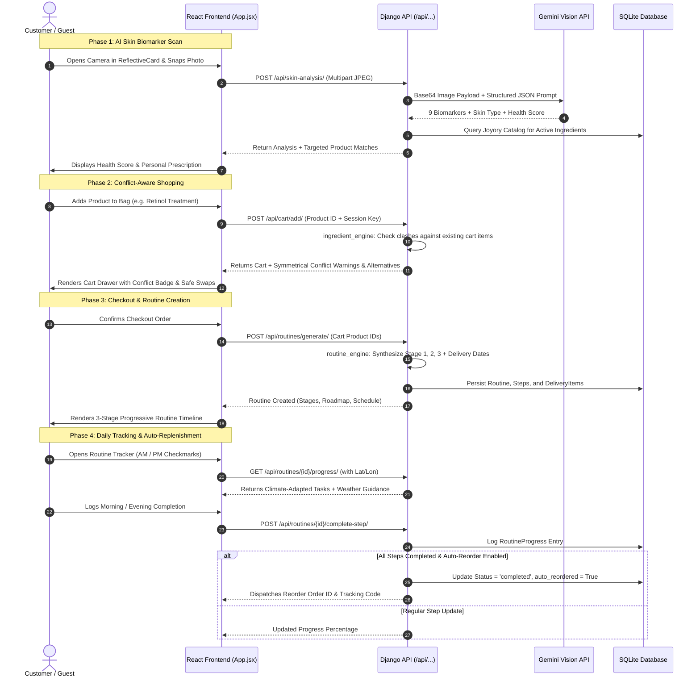
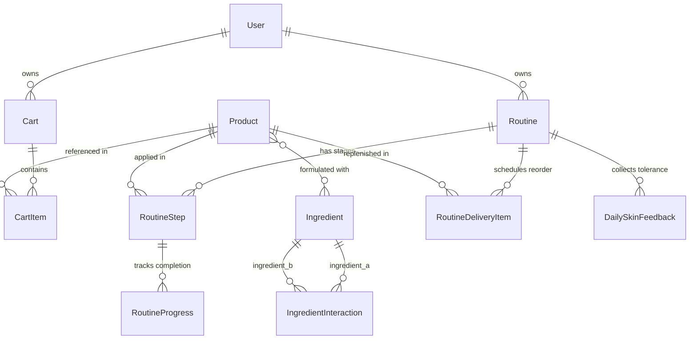

# Joyory — Smart Shopping Experience
> **Comprehensive System Documentation & Technical Reference Manual**  
> *Engineered for Hackathon Task 02 & Enterprise Product Presentation*

---

## 20. Quick Start

Run both servers locally in two separate terminals:

### Terminal 1: Backend (Django REST Framework)
```bash
# 1. Navigate to backend
cd backend

# 2. Activate virtual environment (Windows PowerShell)
.\venv\Scripts\Activate.ps1
# On macOS/Linux: source venv/bin/activate

# 3. Install dependencies & run migrations
pip install -r requirements.txt
python manage.py migrate

# 4. (Optional) Seed 65+ demo products, ingredients & interaction rules
python manage.py seed_demo_data

# 5. Start Django development server (Port 8000)
python manage.py runserver
```

### Terminal 2: Frontend (React 19 + Vite)
```bash
# 1. Navigate to frontend
cd frontend

# 2. Install Node dependencies
npm install

# 3. Start Vite development server (Port 5173)
npm run dev
```

* Open your browser at **`http://localhost:5173/`**.  
* The frontend proxies API calls from `/api` to **`http://127.0.0.1:8000/api`**.  
* The backend health check endpoint is accessible at **`http://127.0.0.1:8000/api/health/`**.

---

## 1. Project Overview

### 1.1 Project Name
**Joyory — Smart Shopping Experience**

### 1.2 What the Project Does
Joyory is an intelligent skincare e-commerce platform and routine companion engineered to bridge the gap between clinical dermatology and consumer shopping. It acts as an active digital pharmacist and routine coach by:
1. Scanning customer facial skin biomarkers via live webcam using the Google Gemini Vision API.
2. Matching detected skin traits against catalog products based on ingredient synergy.
3. Detecting molecular conflicts between active ingredients (e.g., Retinol, AHA/BHA acids, Vitamin C) in real time during cart additions.
4. Analyzing local environmental climate conditions (UV index, humidity, temperature, AQI) to recommend breathable textures and barrier defenses.
5. Automatically synthesizing multi-stage progressive routines that introduce high-potency actives gradually over weeks to prevent barrier shock.
6. Providing a morning/evening daily micro-tracker with compliance logging, daily skin tolerance feedback, and automated delivery replenishment dispatch.

### 1.3 Main Purpose
The primary purpose of Joyory is to prevent consumer skin barrier damage, reduce skincare product abandonment, and provide a guided, adaptive skincare regimen that evolves with the user's skin tolerance and external weather conditions.

### 1.4 Problem It Solves
- **Active Ingredient Conflicts**: High-potency active ingredients (such as 0.5% Retinol and 7% Glycolic Acid) are frequently mixed by uninformed consumers, resulting in contact dermatitis, moisture barrier destruction, and redness. Joyory detects these conflicts symmetrically and recommends gentle alternatives without blocking checkout.
- **Environmental Mismatch**: Applying heavy occlusive creams in high humidity or skipping broad-spectrum SPF during elevated UV index days exacerbates breakouts and photo-aging. Joyory's Climate Engine pulls real-time environmental data to optimize product choices.
- **Barrier Shock from Abrupt Active Introduction**: Dermatologists recommend introducing retinoids and exfoliants progressively over multiple weeks. Joyory schedules products across 3 distinct phases (Foundation $\rightarrow$ Targeted Prep $\rightarrow$ Active Integration).
- **Abandoned Regimens & Run-out Anxiety**: Skincare habits fail when users forget their routine or unexpectedly run out of formulas. Joyory calculates exact bottle lifespans (based on dosage volume and application frequency) and schedules automatic replenishment delivery.

---

## 2. Key Features

| Feature | Category | How It Works |
| :--- | :--- | :--- |
| **Live Facial Biomarker Scan** | AI / Vision | Captures camera frames, compresses image client-side, and proxies to Google Gemini Vision API (`gemini-3.6-flash`). Normalizes 9 clinical biomarkers (oiliness, hydration, pigmentation, pores, redness, texture, fine lines, dark circles, radiance) and scores skin health (0–100). |
| **Clinical Prescription Engine** | AI Recommender | Queries the database using ingredient-level concern mappings to match specific Joyory formulations to the user's Gemini biomarkers without recommending unvetted third-party items. |
| **Symmetric Conflict Detector** | Safety Engine | Cross-references newly added cart items against existing cart/routine products. Identifies molecular clashes (e.g., Retinoid + AHA/BHA) categorized by severity (`warning`, `caution`, `info`) and displays non-blocking recommendations. |
| **Safe Product Alternative Engine** | Shopping Assistant | When a conflict is detected, searches the same category for products that share therapeutic benefits but omit conflicting actives. |
| **Climate Adaptation Engine** | Environmental AI | Queries live weather (temperature, humidity, UV index, air quality) via OpenWeatherMap API (with resilient fallback). Suggests fluid/gel alternatives in high humidity and barrier serums in low humidity. |
| **Progressive Routine Staging** | Clinical Planning | Automatically groups purchased products into a 3-stage calendar: Stage 1 (Barrier Foundation, Wks 1–2), Stage 2 (Hydration Prep, Wk 3), and Stage 3 (Active Integration, Wk 4+). |
| **Morning/Evening Habit Tracker** | Habit Building | Segregates daily tasks into AM and PM sessions with micro-tracking checkmarks, time-stamped completion logs, and progress percentage meters. |
| **Adaptive Daily Skin Feedback** | Feedback Loop | Captures daily skin comfort ("comfortable", "a little dry", "irritated") and dynamically alters routine guidance, advising frequency reduction when irritation occurs. |
| **Automated Replenishment Engine** | Supply Chain | Computes bottle depletion dates using `typical_duration_days` and frequency. Automatically dispatches reorder shipments with tracking IDs upon routine completion when enabled. |
| **3D DriftWall Showcase** | UI / Aesthetics | High-performance 3D tilted continuous conveyor displaying 65 distinct Joyory product formulations. Partitioned across 5 columns such that zero identical photos are visible simultaneously. |
| **Dual Guest & Auth Session Layer** | Security / Identity | Supports guest sessions via `X-Session-ID` and persistent accounts via Django REST Framework `TokenAuthentication`. Automatically syncs guest cart items upon login. |

---

## 3. Technology Stack

### 3.1 Frontend Stack
- **Framework**: React 19.2.8
- **Build Tool & Dev Server**: Vite 8.3.0
- **Styling Architecture**: Vanilla CSS Custom Design System + Tailwind CSS v4 (`@tailwindcss/vite` 4.3.3)
- **Animation & 3D Transitions**: Framer Motion 13.4.0, CSS 3D Transforms (`transform-style: preserve-3d`)
- **Iconography**: Lucide React 1.47.0 + Custom SVG Micro-Icon Library (`Icons.jsx`)
- **Utility Libraries**: `clsx`, `tailwind-merge`
- **Linting & Code Quality**: Oxlint 1.81.0

### 3.2 Backend Stack
- **Web Framework**: Python 3.9+, Django 4.2.x (LTS)
- **API Framework**: Django REST Framework (DRF) 3.14.x
- **Cross-Origin Resource Sharing**: `django-cors-headers` 4.3.x
- **Environment Management**: `python-dotenv` 1.0.x
- **Image Processing**: Pillow (PIL) 10.0.x
- **HTTP Client**: `requests` 2.31.x & `urllib.request`

### 3.3 Database & Storage
- **Primary Database**: SQLite3 (`db.sqlite3` with Django ORM)
- **Asset Storage**: Static & Media file directories hosting 65+ custom product renders (`/images/products/product_1.jpg` ... `product_65.jpg`)
- **Client Cache**: Web `localStorage` for `joyory_session_id`, `joyory_auth_token`, and `joyory_skin_analysis_*`

### 3.4 External APIs & Cloud Services
- **Google Gemini Vision API**: `gemini-3.6-flash` model endpoint (`https://generativelanguage.googleapis.com/v1beta/models`) for facial skin analysis.
- **OpenWeatherMap API**: Live temperature, humidity, UV index, and weather condition feed (with deterministic offline fallback service).

---

## 4. Project Architecture

### 4.1 High-Level Architecture Diagram



### 4.2 Data & Communication Flow
1. **Client Request**: The frontend makes an HTTP request with either `Authorization: Token <key>` (logged in) or `X-Session-ID: <uuid>` (guest).
2. **CORS & Middleware**: Django validates allowed origins (`localhost:5173`) and parses credentials.
3. **View Processing**: The request matches a route in `config/urls.py` $\rightarrow$ `api/urls.py` $\rightarrow$ App views.
4. **Service Engines**: Views delegate complex logic to domain engines (`ingredient_engine.py`, `climate_engine.py`, `routine_engine.py`).
5. **Database ORM**: Data is read or committed transactionally to `db.sqlite3`.
6. **Normalized Response**: JSON payloads return status codes and structured response schemas.

---

## 5. Project Folder Structure

```text
joyory/
├── .gitignore                      # Monorepo ignore rules (Python, Node, SQLite, env)
├── README.md                       # Quick-start developer orientation
├── DOCUMENTATION.md                # Master comprehensive project documentation
│
├── frontend/                       # React 19 + Vite Single Page Application
│   ├── public/                     # Static files directly served
│   │   ├── favicon.svg
│   │   ├── icons.svg
│   │   └── images/
│   │       └── products/           # 65 bespoke product photos (product_1.jpg ... product_65.jpg)
│   ├── src/
│   │   ├── assets/                 # Category banners, icons, luxury hero imagery
│   │   ├── components/             # Reusable UI & Feature views
│   │   │   ├── AuthPage.jsx        # Login, registration, and user switching portal
│   │   │   ├── Cart.jsx            # Cart drawer/page with conflict & climate intelligence
│   │   │   ├── CheckoutModal.jsx   # Order confirmation & automatic routine conversion modal
│   │   │   ├── ClimateInsight.jsx  # Local environmental alert & product recommendation card
│   │   │   ├── ConflictWarning.jsx # Symmetrical ingredient conflict warning banner
│   │   │   ├── DeliverySchedule.jsx# Replenishment auto-delivery schedule manager
│   │   │   ├── DriftWall.jsx       # 3D tilted continuous conveyor showcase
│   │   │   ├── DriftWall.css       # 3D transforms, glassmorphic glaze & lighting styles
│   │   │   ├── Header.jsx          # Top navigation, brand badge, cart counter, auth status
│   │   │   ├── Home.jsx            # Landing page: Hero, ReflectiveCard, DriftWall, Prescriptions
│   │   │   ├── Icons.jsx           # Clean SVG iconography suite
│   │   │   ├── ProductCard.jsx     # Catalog product card with active level badges
│   │   │   ├── ProductDetail.jsx   # Full ingredient list, interaction analysis & modal
│   │   │   ├── ProductGrid.jsx     # Filterable product catalog (Category & Climate filters)
│   │   │   ├── ReflectiveCard.jsx  # Live camera scanning component & AI skin analysis UI
│   │   │   ├── RoutineTimeline.jsx # 3-stage progressive routine roadmap visualization
│   │   │   ├── RoutineTracker.jsx  # Morning/Evening daily habit checklist & climate guidance
│   │   │   ├── SkinFeedbackModal.jsx# Daily skin tolerance feedback logger modal
│   │   │   └── ui/                 # Interactive UI widgets (e.g. grid-pulse.tsx)
│   │   ├── lib/
│   │   │   ├── productsData.js     # Static fallback cache of all 65 Joyory formulations
│   │   │   └── utils.ts            # Currency formatter (`formatRupees`) & class utility (`cn`)
│   │   ├── services/               # API abstraction layer
│   │   │   ├── api.js              # Centralized DRF API service & guest session UUID manager
│   │   │   ├── auth.js             # Token-based authentication service & profile storage
│   │   │   └── skinAnalysis.js     # Multipart camera image upload proxy client
│   │   ├── App.jsx                 # Master application controller & client-side router
│   │   ├── App.css                 # Global luxury styling, typography, theme tokens
│   │   ├── index.css               # Tailwind & base CSS reset
│   │   └── main.jsx                # React DOM root entry
│   ├── .env.example                # Frontend environment template
│   ├── package.json                # Frontend package dependencies & scripts
│   └── vite.config.js              # Vite server configuration & API proxy rules
│
└── backend/                        # Django REST Framework Backend
    ├── api/                        # Central API router & Auth controllers
    │   ├── auth_views.py           # Login, Register, Logout, Me endpoints
    │   ├── urls.py                 # Core routing table
    │   └── views.py                # Health check & Climate analyze views
    ├── cart/                       # Cart & Conflict Detection App
    │   ├── models.py               # Cart and CartItem models
    │   ├── serializers.py          # Cart serialization & conflict payload schemas
    │   ├── urls.py                 # Cart endpoint paths
    │   └── views.py                # Add, update, remove, clear, check-conflicts views
    ├── config/                     # Django project configuration
    │   ├── settings.py             # Installed apps, CORS, auth backends, Gemini settings
    │   ├── urls.py                 # Root URL configuration
    │   ├── wsgi.py                 # WSGI entry point
    │   └── asgi.py                 # ASGI entry point
    ├── products/                   # Skincare Catalog & Ingredient Graph App
    │   ├── models.py               # Product, Ingredient, IngredientInteraction models
    │   ├── serializers.py          # Product & Ingredient serializers
    │   ├── urls.py                 # Product listing & detail routes
    │   ├── views.py                # Filtered product list & detail controllers
    │   └── management/commands/    # Management CLI commands
    │       └── seed_demo_data.py   # Seeder populating 65+ products & clinical interactions
    ├── routines/                   # Progressive Routine & Replenishment App
    │   ├── models.py               # Routine, RoutineStep, RoutineProgress, RoutineDeliveryItem
    │   ├── serializers.py          # Routine progress & delivery schedule serializers
    │   ├── urls.py                 # Routine lifecycle & tracking routes
    │   └── views.py                # Complete-step, complete-all, feedback, reorder views
    ├── services/                   # Algorithmic Domain Engines
    │   ├── climate_engine.py       # UV, humidity, temp, AQI evaluation engine
    │   ├── climate_service.py      # OpenWeatherMap client with resilient fallback
    │   ├── ingredient_engine.py    # Symmetric conflict detector & alternative finder
    │   └── routine_engine.py       # 3-stage routine builder & delivery calculation engine
    ├── skin_analysis/              # Vision AI Proxy & Prescription App
    │   ├── recommender.py          # Biomarker-to-Product clinical prescription matcher
    │   ├── urls.py                 # Skin analysis endpoint
    │   └── views.py                # Gemini Vision API proxy & image compressor
    ├── tests/                      # Automated Verification Test Suite
    │   └── test_backend_suite.py   # 15 comprehensive unit & integration tests
    ├── scripts/                    # Image & asset generation utilities
    │   ├── generate_all_65_photos.py
    │   └── photo_engine.py
    ├── db.sqlite3                  # Pre-seeded SQLite3 database
    ├── manage.py                   # Django CLI executable
    ├── requirements.txt            # Python dependencies
    ├── .env.example                # Backend environment template
    └── .env                        # Local runtime secrets (excluded from Git)
```

---

## 6. Application Workflow



---

## 7. Frontend Documentation

### 7.1 View Controller Architecture
Rather than relying on heavy client-side route reloads, the application utilizes a state-driven view controller in `App.jsx` (`currentView` state):

| View State (`currentView`) | Rendered Component | Purpose |
| :--- | :--- | :--- |
| `'home'` | `<Home />` | Editorial luxury landing page, reflective webcam skin scanner, 3D product DriftWall, and targeted recommendations. |
| `'products'` | `<ProductGrid />` | Catalog browser with category pills (Cleansers, Toners, Serums, etc.) and climate compatibility filters. |
| `'product-detail'` | `<ProductDetail />` | Comprehensive formulation breakdown, clinical usage guide, key ingredients, and cart-conflict alerts. |
| `'cart'` | `<Cart />` | Cart items, quantity updates, real-time conflict banners, hyper-local climate insights, and one-click checkout. |
| `'routine'` | `<RoutineTimeline />` | Multi-week progressive stage roadmap (Weeks 1–2 Foundation, Week 3 Prep, Week 4+ Actives). |
| `'tracker'` | `<RoutineTracker />` | Daily habit micro-tracker separating morning and evening routines with climate timing alerts and skin feel modal. |
| `'delivery'` | `<DeliverySchedule />` | Smart replenishment dashboard displaying projected bottle run-out dates and automated reorder toggles. |
| `'auth'` | `<AuthPage />` | Glassmorphic portal for logging in, registering, or viewing active account details. |

### 7.2 Core UI Components
1. **`ReflectiveCard.jsx`**:
   - Manages live `navigator.mediaDevices.getUserMedia` video stream.
   - Draws video frame to hidden HTML5 canvas for JPEG blob conversion.
   - Handles multi-step UI flow: Live View $\rightarrow$ Capture Preview $\rightarrow$ Scanning Pulse Animation $\rightarrow$ Full Biomarker Dashboard (Radials & Metrics) $\rightarrow$ Direct prescription addition to bag.
2. **`DriftWall.jsx` & `DriftWall.css`**:
   - 3D tilted conveyor with customizable tilt ($19^\circ$), turn ($-16^\circ$), depth, and perspective ($1800\text{px}$).
   - Employs `requestAnimationFrame` with delta-time velocity damping.
   - Renders 5 vertical tracks, each moving in alternating directions.
   - Populated with 65 distinct Joyory product bottles; partitioned so that no identical photo can appear in the same view simultaneously.
   - Hovering triggers a 3D forward lift, clears the white translucent glaze, and displays a frosted-glass price pill.
3. **`RoutineTimeline.jsx`**:
   - Visualizes the 3 clinical stages of routine progression.
   - Renders stage cards with product thumbnails, target concerns, frequency badges, and stage readiness meters.
4. **`RoutineTracker.jsx`**:
   - Provides tabbed Morning and Evening daily task checklists.
   - Enriches each product task with live weather warnings (e.g. "Elevated UV Index: Essential to apply sunscreen before leaving home").
   - Includes quick-action "Complete Morning Routine" and "Complete All Daily Steps" buttons.
5. **`ClimateInsight.jsx`**:
   - Displays live local weather tags (UV severity, humidity, temperature).
   - Dynamically highlights potential environmental risks (e.g. heavy creams in hot & humid climates).

### 7.3 State Management & Client Persistence
- **Guest Session UUID (`joyory_session_id`)**: Created via `Math.random()` and persisted in `localStorage`. Passed in every request header as `X-Session-ID`.
- **Auth Token (`joyory_auth_token`)**: Stored in `localStorage` upon login/registration. Attached as `Authorization: Token <key>`.
- **User Object (`joyory_user`)**: Cached in `localStorage` to avoid unnecessary profile roundtrips.
- **Skin Analysis Snapshot (`joyory_skin_analysis_<userId>`)**: Stored per user to persist skin health scores and biomarker levels across browser sessions.

---

## 8. Backend Documentation

### 8.1 Django Apps Architecture

```text
backend/
├── api/             # Central API Router, Health Check, Token Auth Views
├── products/        # Product, Ingredient, Interaction Models & Catalog Views
├── cart/            # Cart, CartItem Models, Add/Update/Remove, Conflict Checking
├── routines/        # Routine, RoutineStep, Progress, Replenishment Views & Models
├── skin_analysis/   # Gemini Vision API Proxy & Clinical Prescription Matcher
└── services/        # Algorithmic Domain Engines (Conflict, Climate, Routine)
```

### 8.2 Database Models & Entity Relations



### 8.3 Algorithmic Domain Engines

#### 1. Multi-Product Conflict Engine (`services/ingredient_engine.py`)
- Analyzes candidate products against all items currently in the cart or active routine.
- Performs symmetric interaction lookups:
  $$\text{Query: } (A \rightarrow B) \lor (B \rightarrow A)$$
- Severity Hierarchy: `warning` (high risk) $\rightarrow$ `caution` (moderate risk) $\rightarrow$ `info` (compatible synergy).
- Automatically executes fallback product searches in the matching category (`find_alternative_products`) to suggest safe substitutes.

#### 2. Climate Adaptation Engine (`services/climate_engine.py` & `climate_service.py`)
- Ingests latitude/longitude or city query.
- Queries OpenWeatherMap API for live temperature, humidity, UV index, and weather conditions.
- If network fails, falls back to deterministic seasonal climate estimates.
- Rules:
  - $\text{UV} \ge 6$: Warns if sunscreen is missing; validates broad-spectrum protection.
  - $\text{Humidity} \ge 65\%$: Warns against occlusive rich creams; suggests water-gel moisturizers.
  - $\text{Humidity} \le 40\%$: Warns of transepidermal water loss; recommends ceramide/hyaluronic acid barrier repair formulas.
  - $\text{AQI} \ge 100$: Suggests antioxidant serum pairing (Vitamin C / EGCG).

#### 3. Progressive Routine Engine (`services/routine_engine.py`)
- Partitions products by clinical active intensity and category:
  - **Stage 1 (Weeks 1–2: Barrier Foundation)**: Gentle cleansers, barrier moisturizers, mineral SPF.
  - **Stage 2 (Week 3: Targeted Prep & Hydration)**: Balancing toners, hydrating serums, prebiotics.
  - **Stage 3 (Week 4+: Concentrated Active Integration)**: Retinoids, AHA/BHA exfoliants, high-concentration vitamin treatments. Spaced out at non-daily frequency ($2\text{--}3\times/\text{week}$).
- Delivery Scheduling:
  $$\text{Reorder Date} = \text{Today} + \text{typical\_duration\_days}$$

---

## 9. API Documentation

### 9.1 System & Authentication Endpoints

#### `GET /api/health/`
- **Purpose**: System liveness check and server status verification.
- **Auth**: None (Public).
- **Response**:
```json
{
  "status": "healthy",
  "project": "Joyory — Smart Shopping Experience",
  "task": "Hackathon Task 02",
  "timestamp": "2026-09-21T09:40:00Z"
}
```

#### `POST /api/auth/register/`
- **Purpose**: Register a new user account.
- **Auth**: None.
- **Request Body**:
```json
{
  "username": "skincare_lover",
  "email": "user@example.com",
  "password": "SecurePassword123!",
  "first_name": "Jane",
  "last_name": "Doe"
}
```
- **Response** (`201 Created`):
```json
{
  "success": true,
  "token": "4a7f9c8b2e1d0f3a5c7e9b1d3f5a7c9e",
  "user": {
    "id": 2,
    "username": "skincare_lover",
    "email": "user@example.com",
    "first_name": "Jane",
    "last_name": "Doe",
    "full_name": "Jane Doe"
  },
  "message": "Account created successfully!"
}
```

#### `POST /api/auth/login/`
- **Purpose**: Authenticate user via username or email.
- **Auth**: None.
- **Request Body**:
```json
{
  "username": "skincare_lover",
  "password": "SecurePassword123!"
}
```
- **Response** (`200 OK`):
```json
{
  "success": true,
  "token": "4a7f9c8b2e1d0f3a5c7e9b1d3f5a7c9e",
  "user": { "id": 2, "username": "skincare_lover", "email": "user@example.com" },
  "message": "Welcome back, Jane!"
}
```

#### `POST /api/auth/logout/`
- **Purpose**: Invalidate current authentication token.
- **Auth**: `Token <key>`.
- **Response**: `{"success": true, "message": "Logged out successfully."}`

#### `GET /api/auth/me/`
- **Purpose**: Fetch profile data for the authenticated user.
- **Auth**: `Token <key>`.
- **Response**: User object details.

---

### 9.2 Products Endpoints

#### `GET /api/products/`
- **Purpose**: Retrieve filterable product catalog.
- **Query Params**:
  - `category` (string, e.g. `cleanser`, `serum`, `moisturizer`)
  - `climate` (string, e.g. `hot_humid`, `hot_dry`, `cold_dry`)
  - `active_level` (string, e.g. `low`, `medium`, `high`)
  - `search` (string, e.g. `retinol`)
- **Response** (`200 OK`): Array of product objects.

#### `GET /api/products/{id}/`
- **Purpose**: Retrieve single product details, complete ingredient list, and interaction rules.
- **Response** (`200 OK`): Complete product detail dictionary.

---

### 9.3 Cart & Conflict Endpoints

#### `GET /api/cart/`
- **Purpose**: View current cart items, total quantity, and subtotal.
- **Headers/Params**: `X-Session-ID: <uuid>` or `?session_key=<uuid>`.
- **Response** (`200 OK`):
```json
{
  "id": 14,
  "total_items": 2,
  "total_price": "1648.00",
  "items": [
    {
      "id": 22,
      "product": { "id": 1, "name": "Joyory Barrier Calm Gentle Cleanser", "price": "549.00" },
      "quantity": 1,
      "line_total": "549.00"
    }
  ]
}
```

#### `POST /api/cart/add/`
- **Purpose**: Add item to cart with automated ingredient conflict evaluation.
- **Request Body**:
```json
{
  "product_id": 5,
  "quantity": 1,
  "session_key": "sess_abc123"
}
```
- **Response** (`200 OK`):
```json
{
  "message": "Added 'Joyory Midnight Renewal 0.5% Retinol Treatment' to cart.",
  "cart": { ... },
  "conflict_analysis": {
    "has_conflicts": true,
    "has_warnings": true,
    "warnings": [
      {
        "existing_product_name": "Joyory Resurfacing 7% Glycolic AHA Exfoliator",
        "new_product_name": "Joyory Midnight Renewal 0.5% Retinol Treatment",
        "ingredient_a": "Retinol",
        "ingredient_b": "Glycolic Acid (AHA)",
        "severity": "warning",
        "interaction_type": "irritation_risk",
        "message": "Combining Retinol with Glycolic Acid dramatically elevates irritation risk.",
        "suggestion": "Alternate evenings: Apply AHA on Monday, Retinol on Thursday."
      }
    ],
    "alternatives": [
      { "id": 32, "name": "Joyory Gentle Hydrating Recovery Serum", "category": "Serum", "price": "799.00" }
    ]
  }
}
```

#### `POST /api/cart/check-conflicts/`
- **Purpose**: Standalone conflict analysis between a candidate product and a list of product IDs.
- **Request Body**: `{"product_id": 5, "cart_product_ids": [6, 12]}`.

#### `POST /api/cart/climate-analysis/`
- **Purpose**: Evaluate cart items against environmental parameters.
- **Request Body**: `{"latitude": 19.076, "longitude": 72.877}`.

---

### 9.4 Routine & Replenishment Endpoints

#### `POST /api/routines/generate/`
- **Purpose**: Transform product IDs into a multi-stage progressive routine with replenishment schedules.
- **Request Body**:
```json
{
  "product_ids": [1, 3, 5, 31],
  "name": "My Custom Glass Skin Routine"
}
```
- **Response** (`201 Created`): Returns routine ID, stages list, weekly roadmap, and delivery schedule.

#### `GET /api/routines/`
- **Purpose**: List all routines belonging to the authenticated user or guest session.

#### `GET /api/routines/{id}/progress/`
- **Purpose**: Get daily progress metrics, morning/evening segregated tasks, and weather timing insights.
- **Query Params**: `?latitude=19.076&longitude=72.877&date=2026-09-21`.

#### `POST /api/routines/{id}/complete-step/`
- **Purpose**: Record completion of a specific step (supports `morning`, `evening`, or `all` sessions).
- **Request Body**:
```json
{
  "step_id": 12,
  "session": "morning",
  "completed": true,
  "notes": "Skin feels hydrated and supple."
}
```

#### `POST /api/routines/{id}/feedback/`
- **Purpose**: Submit daily skin tolerance feedback.
- **Request Body**: `{"skin_feel": "comfortable", "notes": "No tingling or redness"}`.

#### `GET /api/routines/{id}/delivery-schedule/`
- **Purpose**: Retrieve projected bottle run-out dates and automated replenishment items.

---

### 9.5 AI Vision Skin Analysis Endpoint

#### `POST /api/skin-analysis/`
- **Purpose**: Proxy facial webcam capture to Google Gemini Vision API for biomarker extraction.
- **Content-Type**: `multipart/form-data`.
- **Form Data**: `image: <JPEG/PNG file binary>`.
- **Response** (`200 OK`):
```json
{
  "success": true,
  "analysis": {
    "skin_type": "Combination",
    "overall_health_score": 82,
    "metrics": {
      "oiliness": { "level": "moderate", "score": 62 },
      "hydration": { "level": "high", "score": 78 },
      "pigmentation": { "level": "low", "score": 25 },
      "pores": { "level": "moderate", "score": 45 },
      "redness": { "level": "low", "score": 18 },
      "texture": { "level": "low", "score": 22 },
      "fine_lines": { "level": "low", "score": 15 },
      "dark_circles": { "level": "moderate", "score": 48 },
      "radiance": { "level": "high", "score": 85 }
    }
  },
  "recommendations": [
    {
      "product_id": 13,
      "name": "Joyory Pore Clarifying BHA Foaming Wash",
      "category": "Cleanser",
      "price": "649.00",
      "reason": "Formulated with Salicylic Acid to clear congested pores and regulate excess sebum."
    }
  ]
}
```

---

## 10. Database Documentation

### 10.1 Database Engine
- **Engine**: SQLite3 (`django.db.backends.sqlite3`)
- **File**: `backend/db.sqlite3`
- **Design Decision**: Lightweight, serverless zero-configuration database ideal for rapid hackathon demonstrations and local deployment. Easily migratable to PostgreSQL via `settings.py` `DATABASES` configuration.

### 10.2 Table Schema Specifications

#### 1. `products_ingredient`
- `id` (IntegerField, Primary Key, Auto Increment)
- `name` (CharField 150, Unique)
- `slug` (SlugField 150, Unique)
- `category` (CharField 50: `exfoliant`, `retinoid`, `antioxidant`, `humectant`, `lipid`, `peptide`, `sunscreen_filter`, `soothing`, `other`)
- `description` (TextField)

#### 2. `products_ingredientinteraction`
- `id` (IntegerField, PK)
- `ingredient_a_id` (ForeignKey $\rightarrow$ `products_ingredient`)
- `ingredient_b_id` (ForeignKey $\rightarrow$ `products_ingredient`)
- `severity` (CharField 20: `info`, `caution`, `warning`)
- `interaction_type` (CharField 50: `irritation_risk`, `barrier_stress`, `ph_dependency`, `reduced_efficacy`, `compatible_synergy`, `sun_sensitivity`)
- `message` (TextField)
- `recommendation` (TextField)
- *Constraint*: `unique_together = ('ingredient_a', 'ingredient_b')`

#### 3. `products_product`
- `id` (IntegerField, PK)
- `name` (CharField 255)
- `brand` (CharField 150, default `'Joyory'`)
- `category` (CharField 50: `cleanser`, `toner`, `serum`, `moisturizer`, `exfoliant`, `sunscreen`, `treatment`)
- `price` (DecimalField 10, 2)
- `texture` (CharField 50: `gel`, `lightweight_lotion`, `rich_cream`, `oil`, `foam`, `liquid`)
- `suitable_climate` (CharField 50: `all`, `hot_humid`, `hot_dry`, `cold_dry`)
- `hydration_level` (CharField 50: `light`, `moderate`, `deep`)
- `active_level` (CharField 20: `low`, `medium`, `high`)
- `time_of_day` (CharField 20: `morning`, `evening`, `both`)
- `typical_duration_days` (IntegerField, default 60)
- `skin_types` (CharField 255)
- `concerns` (CharField 255)
- `routine_stage` (IntegerField: 1, 2, or 3)
- `image_url` (CharField 500)
- `ingredients` (ManyToManyField $\rightarrow$ `products_ingredient`)

#### 4. `cart_cart` & `cart_cartitem`
- `cart_cart`: `id`, `session_key` (indexed), `user_id` (nullable FK $\rightarrow$ `auth_user`), `created_at`, `updated_at`.
- `cart_cartitem`: `id`, `cart_id` (FK), `product_id` (FK), `quantity` (PositiveInt). Constraint: `unique_together = ('cart', 'product')`.

#### 5. `routines_routine`
- `id` (IntegerField, PK)
- `user_id` (Nullable FK $\rightarrow$ `auth_user`)
- `session_id` (CharField 100, indexed)
- `name` (CharField 200)
- `status` (CharField 20: `active`, `completed`, `paused`)
- `auto_reorder_enabled` (BooleanField, default True)
- `auto_reordered` (BooleanField, default False)
- `auto_reorder_date` (DateTimeField, nullable)
- `auto_reorder_order_id` (CharField 100, nullable)
- `created_at` (DateTimeField)

#### 6. `routines_routinestep`
- `id` (IntegerField, PK)
- `routine_id` (FK $\rightarrow$ `routines_routine`)
- `product_id` (FK $\rightarrow$ `products_product`)
- `stage_number` (IntegerField: 1, 2, 3)
- `stage_name` (CharField 100)
- `week_start` (IntegerField), `week_end` (IntegerField)
- `frequency` (CharField 50)
- `time_of_day` (CharField 20: `morning`, `evening`, `both`)
- `order` (IntegerField)
- `completed` (BooleanField), `morning_completed` (BooleanField), `evening_completed` (BooleanField)

#### 7. `routines_routineprogress`
- `id` (IntegerField, PK)
- `routine_step_id` (FK $\rightarrow$ `routines_routinestep`)
- `date` (DateField)
- `session` (CharField 20: `morning`, `evening`, `all`)
- `completed` (BooleanField)
- `notes` (TextField)

#### 8. `routines_routinedeliveryitem`
- `id` (IntegerField, PK)
- `routine_id` (FK $\rightarrow$ `routines_routine`)
- `product_id` (FK $\rightarrow$ `products_product`)
- `suggested_reorder_date` (DateField)
- `frequency_weeks` (IntegerField)
- `status` (CharField 50: `scheduled`, `auto_reordered`, `delivered`)
- `tracking_number` (CharField 100, nullable)

#### 9. `routines_dailyskinfeedback`
- `id` (IntegerField, PK)
- `routine_id` (FK $\rightarrow$ `routines_routine`)
- `date` (DateField)
- `skin_feel` (CharField 30: `comfortable`, `dry`, `irritated`)
- `notes` (TextField)
- *Constraint*: `unique_together = ('routine', 'date')`

---

## 11. Authentication & Security

### 11.1 Authentication Mechanism
- **Backend Protocol**: Django REST Framework `TokenAuthentication` combined with standard Django user models (`django.contrib.auth.models.User`).
- **Token Generation**: Upon successful login or registration via `/api/auth/login/` or `/api/auth/register/`, a 40-character hex key is issued from `authtoken_token`.
- **Client Transport**: Transmitted in the HTTP header:
  `Authorization: Token <key>`

### 11.2 Guest Session Management
- **Guest Isolation**: When unauthenticated, the client stores a random UUID (`joyory_session_id`) in `localStorage`.
- **Header Protocol**: Sent with each request as `X-Session-ID: sess_<uuid>`.
- **Cart & Routine Scoping**: Database queries filter strictly on `session_key=s_key, user=None`. Guest data never leaks into authenticated profiles.

### 11.3 Security & Safe Engineering Practices
- **API Key Confidentiality**: The Gemini Vision API key (`GEMINI_API_KEY`) and weather API key (`WEATHER_API_KEY`) are loaded strictly in the backend via `python-dotenv`. They are **never** bundled in frontend Vite code, logged, or returned in response payloads.
- **Image Upload Sanitization**:
  - Strict MIME validation (`image/jpeg`, `image/png`, `image/webp`).
  - Hard cap of 10 MB payload limit (`MAX_IMAGE_SIZE_BYTES`).
  - Minimum sanity threshold of 1 KB to prevent empty buffer attacks.
  - Image down-sampling via Pillow with Lanczos filtering to a maximum dimension of 1280px to protect downstream memory.
- **CORS Protection**: Restricted via `django-cors-headers` to approved local origins (`localhost:5173`, `127.0.0.1:5173`) with credentials enabled.
- **Password Protection**: Passwords validated through Django's 4 standard validators (Attribute Similarity, Minimum Length, Common Password, Numeric Check).

---

## 12. Installation & Setup

### 12.1 Prerequisites
- **Python**: Version 3.9 or higher
- **Node.js**: Version 18.0 or higher
- **Package Managers**: `pip` (Python) and `npm` (Node)
- **Git**: Installed and configured

### 12.2 Step-by-Step Installation

#### 1. Clone the repository
```bash
git clone https://github.com/yashgajera00/joyory.git
cd joyory
```

#### 2. Backend Configuration
```bash
cd backend

# Create virtual environment
python -m venv venv

# Activate virtual environment
# Windows (PowerShell):
.\venv\Scripts\Activate.ps1
# macOS/Linux:
source venv/bin/activate

# Install Python dependencies
pip install -r requirements.txt

# Create .env configuration
cp .env.example .env
# Edit .env and supply your GEMINI_API_KEY (from Google AI Studio)

# Execute migrations
python manage.py migrate

# Seed 65+ demo formulations, ingredients, and clinical interactions
python manage.py seed_demo_data

# Run automated test suite to confirm setup
python manage.py test tests
```

#### 3. Frontend Configuration
```bash
cd ../frontend

# Install node dependencies
npm install

# Create .env configuration
cp .env.example .env

# Verify production bundle builds without errors
npm run build
```

#### 4. Running the Project Locally
- Run `python manage.py runserver` in the `backend/` folder (runs on `http://127.0.0.1:8000`).
- Run `npm run dev` in the `frontend/` folder (runs on `http://localhost:5173`).
- Navigate to `http://localhost:5173` to explore the application.

---

## 13. Deployment

### 13.1 Architecture for Production
Joyory is structured as a decoupled SPA + REST API architecture:
- **Frontend Hosting**: Can be hosted on Vercel, Netlify, Cloudflare Pages, or AWS S3 + CloudFront.
  - **Build Command**: `npm run build`
  - **Output Directory**: `dist/`
  - **Environment Variable**: `VITE_API_BASE_URL=https://api.yourdomain.com/api`
- **Backend Hosting**: Can be hosted on Render, Railway, Fly.io, AWS Elastic Beanstalk, or an Ubuntu VPS (with Gunicorn + Nginx).
  - **Start Command**: `gunicorn config.wsgi:application --bind 0.0.0.0:$PORT`
  - **Static Assets**: Can be served via `whitenoise` or reverse-proxied by Nginx.
  - **Database Migration**: Switch `DATABASES['default']` in `config/settings.py` to `django.db.backends.postgresql` with `DATABASE_URL`.

---

## 14. Environment Variables & Configuration

### 14.1 Backend Environment Variables (`backend/.env`)
| Variable Name | Required | Default / Example Value | Description |
| :--- | :---: | :--- | :--- |
| `DEBUG` | No | `True` | Django debug mode toggle (set to `False` in production). |
| `SECRET_KEY` | Yes | `django-insecure-...` | Cryptographic signing key for Django sessions and tokens. |
| `ALLOWED_HOSTS` | Yes | `localhost,127.0.0.1` | Comma-separated list of permitted host headers. |
| `CORS_ALLOWED_ORIGINS`| Yes | `http://localhost:5173` | Permitted frontend origin URLs for CORS requests. |
| `WEATHER_API_KEY` | No | OpenWeatherMap Key | API key for live climate and air quality queries. |
| `GEMINI_API_KEY` | Yes | `AIzaSy...` | Google AI Studio key for camera skin biomarker scanning. |
| `GEMINI_MODEL_NAME` | No | `gemini-3.6-flash` | Gemini model name used for vision content generation. |

### 14.2 Frontend Environment Variables (`frontend/.env`)
| Variable Name | Required | Default Value | Description |
| :--- | :---: | :--- | :--- |
| `VITE_API_BASE_URL` | No | `/api` | Base URL prefix for backend REST API requests. |

---

## 15. Error Handling

### 15.1 Frontend Resilience
- **API Connectivity Loss**: If the Django server is unreachable, `Home.jsx` gracefully falls back to the embedded 65-product offline cache (`productsData.js`) so the 3D DriftWall and catalog never render empty.
- **Image Fallback Handlers**: All product image tags implement `onError={(e) => { e.target.src = '/images/products/product_1.jpg'; }}` to prevent broken image icons if an asset path fails.
- **Toast Notifications**: Non-blocking toast notifications auto-dismiss after 4 seconds for cart additions, order confirmations, and authentication notices.

### 15.2 Backend Validation & Safe Fallbacks
- **Climate Service Network Failure**: If the external weather service times out or errors, `services/climate_service.py` intercepts the exception and serves a deterministic fallback climate object (`"is_fallback": True`), ensuring the checkout and routine tracking never fail.
- **Gemini Vision API Malformed Output**: `skin_analysis/views.py` contains `_extract_gemini_json` to clean Markdown fences (````json ... ````) and normalizes missing biomarker attributes to default neutral values.
- **Non-Blocking Conflict Warnings**: Cart operations with conflicting actives return HTTP 200 with `has_conflicts: true`, allowing customers to make informed purchasing decisions without being abruptly blocked.

---

## 16. Current Limitations

Based on inspection of the actual source code, the following architectural characteristics should be noted:
1. **Database Engine**: Uses SQLite3. While fast and zero-configuration for demo and development purposes, production deployments with concurrent transactions should migrate to PostgreSQL.
2. **Couriers & Tracking Numbers**: Delivery tracking numbers are generated synthetically (e.g. `EXP-IN-B39F1C02`) by the replenishment engine rather than integrating with live courier webhooks (e.g., Delhivery, FedEx, or Shiprocket).
3. **Webcam Lighting Dependency**: The camera biomarker scan relies on ambient user lighting; low-light images may produce variance in Gemini's texture and radiance scores.
4. **Single Active Routine Focus**: The UI currently highlights the customer's primary progressive routine, though the backend schema supports multiple routines.

---

## 17. Future Improvements

*(The following are suggestions based on the current implementation, not existing code features)*:

1. **Native Payment Gateway Integration**: Integrate Razorpay or Stripe webhooks into the checkout modal for real credit card, UPI, and net banking processing.
2. **Third-Party Product Barcode Scanner**: Allow users to scan barcodes of existing products in their home bathroom cabinet to ingest them into Joyory's active conflict engine.
3. **Automated WhatsApp / Push Reminders**: Send morning and evening WhatsApp routine micro-tracking reminders adapted to real-time daily weather shifts.
4. **PostgreSQL + Celery Worker Queue**: Migrate the SQLite database to managed PostgreSQL and offload Gemini image compression and climate API queries to asynchronous Celery tasks with Redis.
5. **Periodic Progress Photo Comparison**: Allow users to capture weekly selfie updates to track biomarker improvements (e.g. redness reduction or radiance increase) side-by-side.

---

## 18. Team / Contribution

### 18.1 Hackathon Roles (from Project Specification)
- **Developer 1 (Backend)**: Django, Django REST Framework, SQLite Database, CORS Middleware, Algorithmic Services (Conflict, Climate, Progressive Routine Engines), Gemini Vision API integration, Automated Test Suite.
- **Developer 2 (Frontend)**: React 19, Vite, Tailwind CSS v4, Vanilla CSS Custom Design System, Live Webcam Frame Capture, 3D DriftWall Showcase, Habit Micro-Tracker, Delivery Schedule Dashboard.

### 18.2 Contributing Guidelines
1. Fork or branch from `main`: `git checkout -b feature/your-feature-name`.
2. Ensure both Django tests and Vite production builds pass:
   ```bash
   # Backend
   cd backend && python manage.py test tests
   # Frontend
   cd frontend && npm run build
   ```
3. Commit with descriptive messages and open a Pull Request.

---

## 19. Demo & Screenshots

### 19.1 Existing Project Assets
The repository contains asset graphics located in `frontend/src/assets/`:
- **Editorial Brand Banner**: `frontend/src/assets/hero.png`
- **Product Categories**: `cleansers.png`, `toners.png`, `serums.png`, `exfoliants.png`, `moisturizers.png`, `sunscreens.png`, `all.png`
- **Catalog Imagery**: 65 bespoke formula renders in `frontend/public/images/products/product_1.jpg` through `product_65.jpg`

### 19.2 Recommended Presentation Screenshots
*(Placeholders to insert exported screenshots for presentation slide decks)*

```text
[ Screenshot Placeholder 1: Editorial Landing Page with ReflectiveCard & Live Webcam Scanner ]
[ Screenshot Placeholder 2: 3D DriftWall Rotating Conveyor showcasing 65 Joyory Formulations ]
[ Screenshot Placeholder 3: Live Cart Drawer with Active Ingredient Conflict Warning & Alternatives ]
[ Screenshot Placeholder 4: Progressive Routine Timeline showing 3-Stage Barrier Build Roadmap ]
[ Screenshot Placeholder 5: Daily Habit Micro-Tracker with Climate Timing Warnings ]
[ Screenshot Placeholder 6: Automated Replenishment & Delivery Schedule Dashboard ]
```

---

## Documentation Verification

The following codebase files, components, and schemas were thoroughly inspected to generate this documentation without altering project code:

- [x] **Monorepo Configuration**: `README.md`, `.gitignore`, `backend/requirements.txt`, `frontend/package.json`, `frontend/vite.config.js`.
- [x] **Django Core Settings**: `backend/config/settings.py`, `backend/config/urls.py`, `backend/config/wsgi.py`, `backend/config/asgi.py`.
- [x] **Database Models**:
  - `backend/products/models.py` (`Product`, `Ingredient`, `IngredientInteraction`)
  - `backend/cart/models.py` (`Cart`, `CartItem`)
  - `backend/routines/models.py` (`Routine`, `RoutineStep`, `RoutineProgress`, `RoutineDeliveryItem`, `DailySkinFeedback`)
- [x] **Algorithmic Domain Engines**:
  - `backend/services/ingredient_engine.py` (`analyze_product_conflicts`, `find_alternative_products`)
  - `backend/services/climate_engine.py` (`evaluate_climate_adaptation`, `evaluate_daily_tracker_weather_timing`)
  - `backend/services/climate_service.py` (`ClimateService` with OpenWeatherMap & fallback)
  - `backend/services/routine_engine.py` (`generate_progressive_routine`, `generate_delivery_schedule`)
  - `backend/skin_analysis/recommender.py` (`recommend_products`, `INGREDIENT_SIGNALS`)
- [x] **REST Controllers & Routes**:
  - `backend/api/urls.py`, `backend/api/views.py`, `backend/api/auth_views.py`
  - `backend/products/urls.py`, `backend/products/views.py`, `backend/products/serializers.py`
  - `backend/cart/urls.py`, `backend/cart/views.py`, `backend/cart/serializers.py`
  - `backend/routines/urls.py`, `backend/routines/views.py`, `backend/routines/serializers.py`
  - `backend/skin_analysis/urls.py`, `backend/skin_analysis/views.py`
- [x] **Test Suite**:
  - `backend/tests/test_backend_suite.py` (Validated all 15 test scenarios for Task 02)
- [x] **Frontend Architecture & Components**:
  - `frontend/src/App.jsx`, `frontend/src/App.css`, `frontend/src/index.css`
  - `frontend/src/services/api.js`, `frontend/src/services/auth.js`, `frontend/src/services/skinAnalysis.js`
  - `frontend/src/components/Home.jsx`, `DriftWall.jsx`, `ReflectiveCard.jsx`, `ProductGrid.jsx`, `ProductDetail.jsx`, `Cart.jsx`, `ConflictWarning.jsx`, `ClimateInsight.jsx`, `RoutineTimeline.jsx`, `RoutineTracker.jsx`, `DeliverySchedule.jsx`, `AuthPage.jsx`.
- [x] **Data Assets**:
  - `frontend/public/images/products/` (Confirmed all 65 product JPEG files exist on disk)
  - `frontend/src/lib/productsData.js` (Export of 65 product details)
